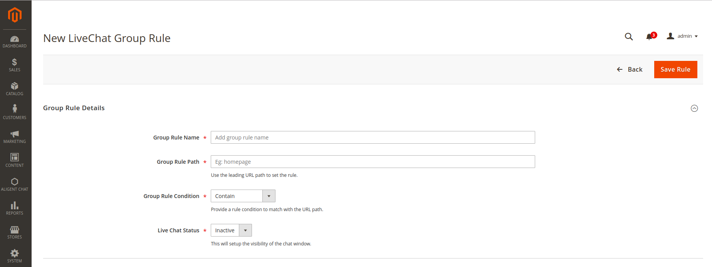
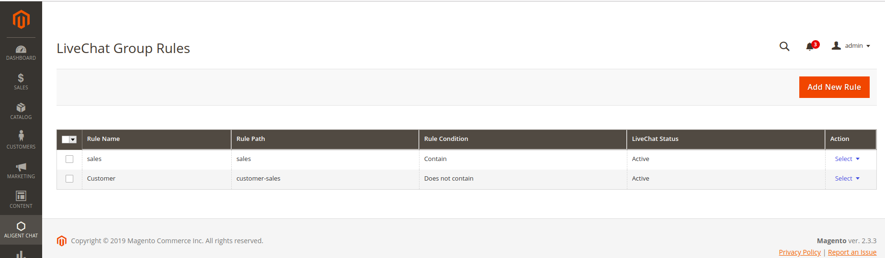
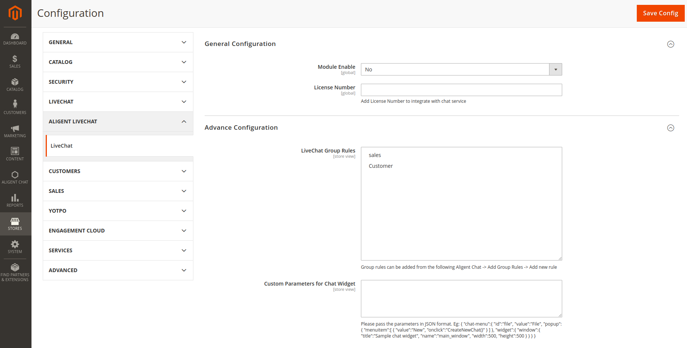

# Magento 2 Live Chat Module 

This Extension is used to integrate LiveChat features to Magento 2.  

### Prerequisites
* Composer
* Magento 2.3.x instance.

### Installation

* `composer config repositories.module-livechat vcs git@github.com:jehanben/module-livechat.git`
* `composer require aligent/module-livechat:dev-master`
* `php bin/magento module:enable Aligent_LiveChat`
* `php bin/magento setup:upgrade`

### Features

* Connecting chatting service via license.
* Setup group rules based on URLs.

### Usage
Once the module is installed backend user will have the following features.

#### Adding Rules
*Aligent Chat -> Add group rules -> Add New Rule*

Once added the rule can be viewed on the grid view.
Also edit and delete options are available on the grid view for the user.

 
#### Adding System Configurations 
*Stores > Setting > Configuration > Aligent LiveChat > LiveChat*

 

* User need to provide the Licence Number in order to integrate with chat service.
* The selected live chat group rules will be applied on the frontend.
* User need to provide the JSON output of the custom parameters provided by the chat service.

